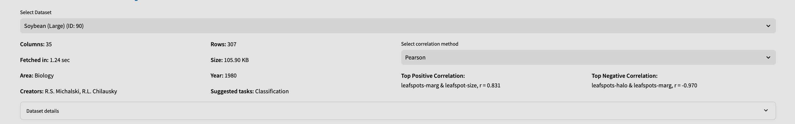
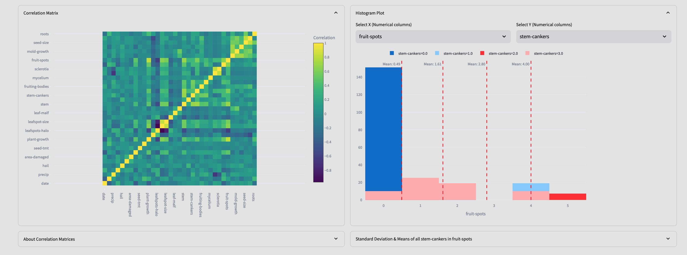
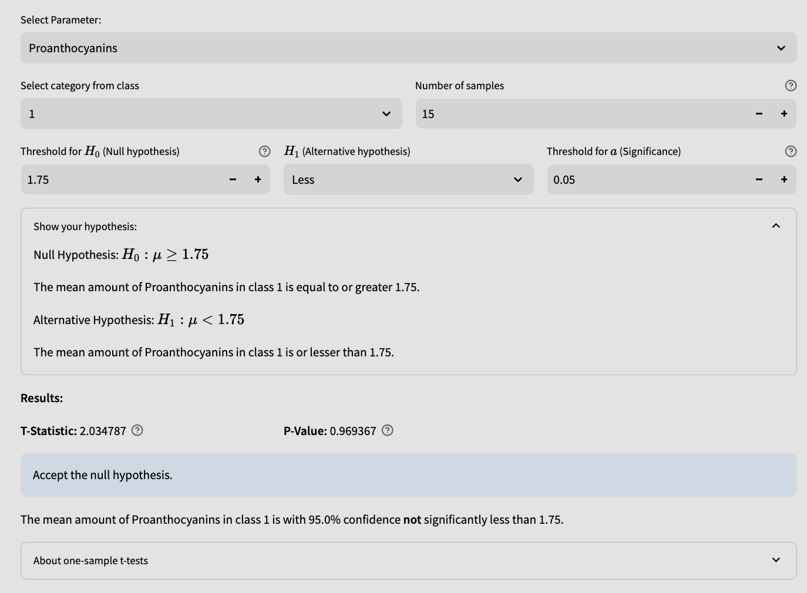
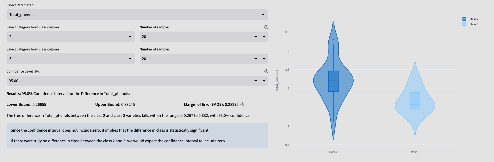
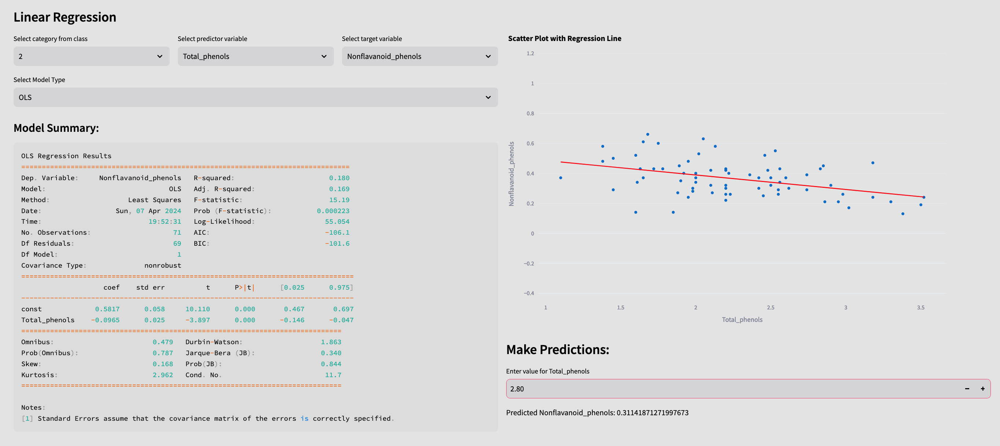

# UC Irvine ML Repo Dataset Loader

A Streamlit interface for performing data analysis tasks such as hypothesis testing, linear regression modeling, and correlation analysis.

No datasets required, load and analyze any dataset from the [UC Irvine Machine Learning Repository](https://archive.ics.uci.edu/)



### **Correlation Analysis:**


Calculate correlation matrices using Pearson, Kendall, or Spearman methods.

### **Hypothesis Testing:**


Perform one-sample t-tests, proportions z-tests, and confidence interval estimation.



### **Linear Regression Modeling:**

The Hello World of ML. Build ordinary least squares (OLS), weighted least squares (WLS), and generalized least squares (GLS) regression models.

## Installation

Before running the app, ensure you have Python installed on your system. You can install the required Python packages by running:

```bash
pip install -r requirements.txt
```

## Usage

To launch the Streamlit app, run the following command in your terminal:

```bash
streamlit run app.py
```

This will open the app in your default web browser, where you can interact with the various features.

## Contributing

Contributions are welcome! If you encounter any issues (there are a couple) or have suggestions, please feel free to open an issue or submit a pull request.